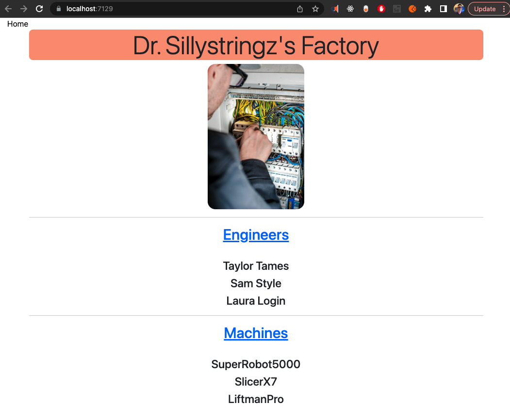
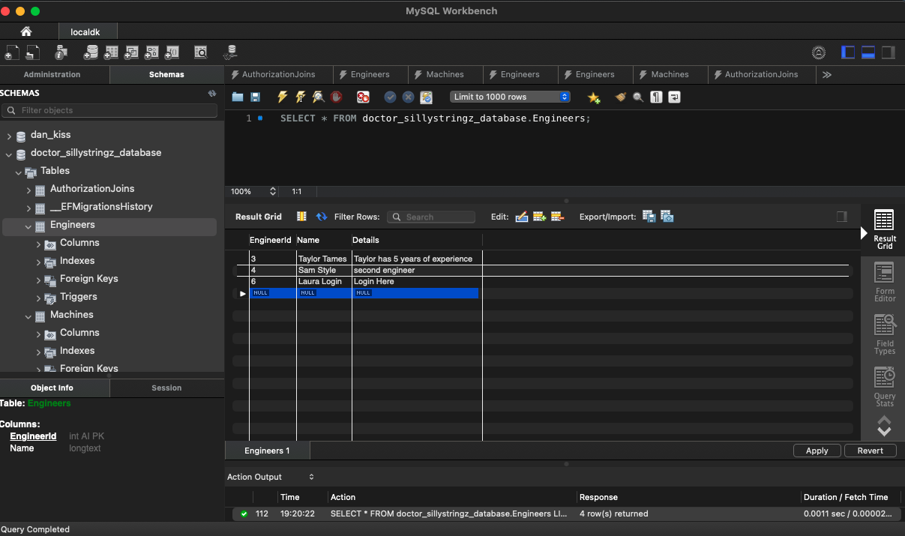
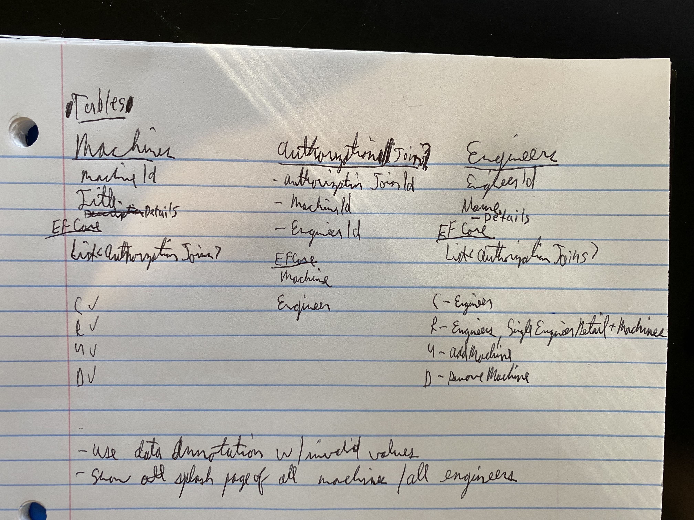

# _{Dr. Sillystringz's Factory with Many-to-Many Data Relationships, C#, .NET and Entity Framework Core}_

#### By _**{Dan Kiss}**_


#### _{Dr. Sillystringz's Factory with Many-to-Many Data Relationships is an ASP.NET Core MVC app using Entity Framework Core. It is written in C# and allows the user to connect to to a MySQL database where the user will store added Engineers and Machines and once a Engineer is made a Machine can be associated with it and vice versa using a join table.}_

## Technologies Used

* Entity Framework Core
* Join Table Model
* MySQL
* MySQL Workbench
* ASP.NET Core MVC
* .NET Core
* .NET CLI
* C#
* Razor
* CSS

## Description

To run the application navigate to the Factory folder in the command line and add a file named appsettings.json that is filled in as below, change [username] and [password] to the username and password you have in MySQL server. MySQL server must be installed on your machine to run this project.

```
{
    "ConnectionStrings": {
    "DefaultConnection": "Server=localhost;Port=3306;database=doctor_sillystringz_database;uid=[username];pwd=[password];"
}
}
```

Once you have set up appsettings.json while in the Factory folder run 

$ dotnet restore

Now add the database called dan_kiss.sql and see it in MySQL Workbench.

In the Factory folder run the migration
$ dotnet ef database update

If wanted to add new columns in MySQL make a new migration and run the command below, change [DescribeYourMigration] to a description you like and remember to commit the changes.
$ dotnet ef migrations add [DescribeYourMigration]
To include the new database migration again run
$ dotnet ef database update



After you are finished with the above steps, go to MySQL the Navigator > Schemas tab. Right click and select Refresh All. Our new test database and tables will appear.

Database Tables



Now go to the Factory folder and run

$ dotnet run

As Entity Framework Core is used with the standard naming convention there is not testing added as there is not unique functions used that should be tested.

## Setup/Installation Requirements

* _navigate to the Factory folder and run_
* _$ dotnet restore_
* _run $ dotnet run_
* _Go to localhost:7129_
* _Click Engineers_
* _Click Create an engineer_
* _Fill out the name and details about them note if left blank you get a warning and are asked to try again_
* _Click Add new engineer
* _You are taken back to the engineers page_
* _Make another new engineer_
* _Click the home text at the top left_

* _Click Home
* _Click Machines
* _Click Create a Machine
* _Fill out the title and details about them note if left blank you get a warning and are asked to try again_
* _Click Add new machine_
* _You are taken back to the machines page_
* _Make another new machine

* _Click Home
* _Click Engineers
* _Click on the engineer you made_
* _Click Add a machine to engineer
* _Select a machine you made and click Add Machine_
* _Select a different machine you made and click Add Machine_
* _Click on the name of machine_
* _Click on Delete access you will see the machine is not having a reference to the engineer so the join table entry was deleted_

* _You can delete an engineer_
* _You can edit an engineer's details_

_{Double check that the bin and obj folders are created in the Factory folder}_

## Known Bugs

* _None_

## Idea to expand on

* _Make a page showing engineers not assigned to any machines, show machines not assigned any engineers. Add more customer friendly routing as you move between screens. Make url strings lowercase.

## Notes on project

* _Important to ensure the model is passed to the View when needed using View(model) to avoid NullReferenceException_
* _The naming convention for Entity Framework Core must be followed in the model to be able to capture all data from the form used to create new objects from Views including SelectList dropdowns_
* _.NET CLI was used to make initial project structure $ dotnet new mvc_

## Git Note
Remove bin and obj folders from git with 
$ git rm --cached obj -r 
$ git rm --cached bin -r

## License

_{MIT License}_

Copyright (c) _2023_ _Daniel Kiss_